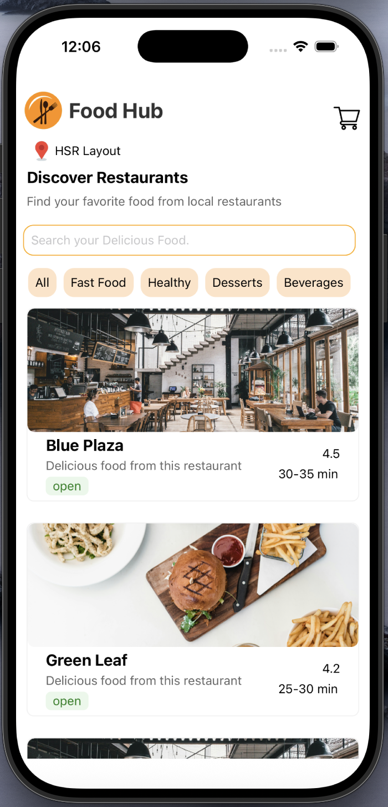
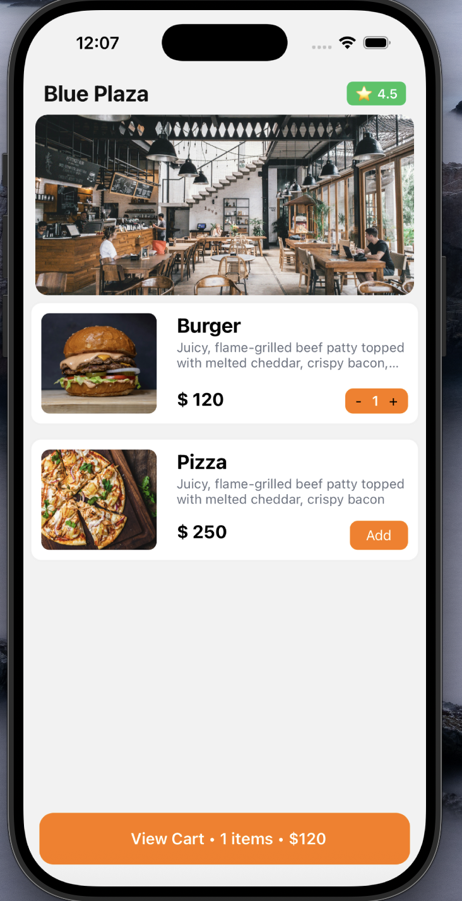

# Mini Food Delivery App

A small food delivery app built using React Native with a mock REST API.

## Setup

# Step 1
1. Clone the repository
2. Install dependencies
   npm install

# Step 2 

1.Start mock API
  cd mock-api
  json-server --watch db.json --port 3000

# Step 3

npx react-native run-ios
  # or
npx react-native run-android

## Architecture Decisions

- React Native is used for UI rendering and navigation
- TanStack Query handles server state like restaurant and menu data
- Zustand is used for global client state such as cart items
- API logic is separated from UI components to keep components clean

## UI Preview

